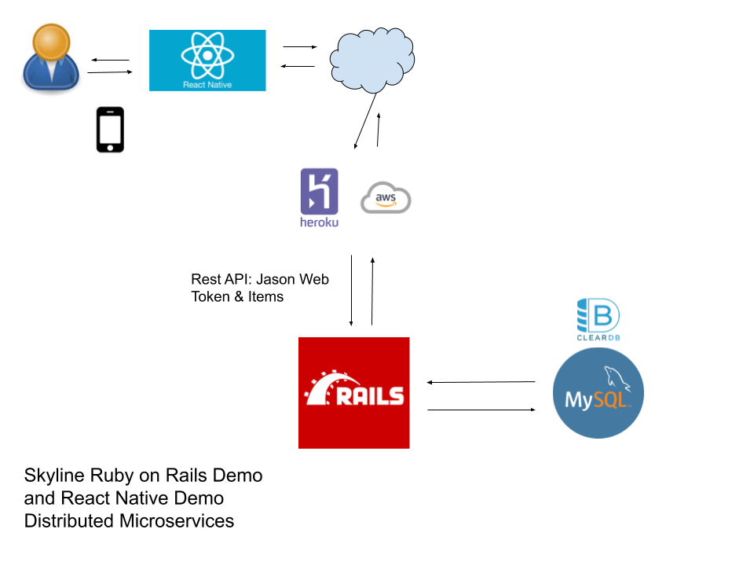

# skyline-mobile-demo
Pretty mobile navigation demo

## Distributed Microservices Demo
"Skyline mobile" is part of a complete distributed microservices demo that has a backend running "Ruby on Rails" found [here](https://github.com/radkin/skyline_ror_demo).


## Up and running

Notes:
* At present, the web version of this application fails on compile. Cross compatibility with web is out of scope.
* This is an expo implementation. The CLI (react-native-cli) approach is not working. Examples of failures: `react-native start`, `npx react-native run-android`, `npm react-native init`

### Set up dev environment

OS Requirements
```bash
sudo apt-get install qemu-kvm libvirt-daemon-system libvirt-clients bridge-utils
```

* Install `Android Studio` via the Ubuntu "software" link in the UI
* Click on "start a new android studio project" and make sure the "Android Emulator, Android SDK Platform Tools, Android SDK Tools, and Google Play Services" have been installed.
* Use the AVD manager to install your device.
* Give it a lot of time because many things need to install and get set up.

```bash
cd skyline-mobile-demo
npm install -g expo-cli
npm install
```

### Start up
`npm start`
hit the letter "a" on the command-line and wait for the code to show up on your device.

## Author
radkin@github.com (not a proper email address)
